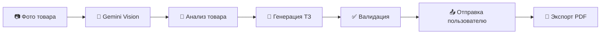

# 🎨 TZшник — AI-генератор технических заданий для инфографики

<div align="center">


**Telegram-бот для автоматической генерации технических заданий на создание инфографики карточек товаров для маркетплейсов Wildberries и Ozon**

[🚀 Попробовать бота](https://t.me/tzshnik_bot) · [📖 Документация](docs/) · [🐛 Сообщить о баге](https://github.com/Prot1vn1kk/TZshnik/issues)

</div>

---

## 📋 О проекте

**TZшник** — это интеллектуальный Telegram-бот, который анализирует фотографии товаров с помощью AI (Google Gemini) и автоматически генерирует профессиональные технические задания для дизайнеров инфографики.

### 🎯 Проблема, которую решает бот

Продавцы на маркетплейсах тратят много времени на составление ТЗ для дизайнеров:
- Нужно продумать структуру слайдов
- Написать продающие заголовки
- Определить ключевые УТП товара
- Учесть требования площадок WB и Ozon

**TZшник автоматизирует этот процесс** — загрузите фото товара, выберите категорию, и через 30-60 секунд получите готовое ТЗ!

### ✨ Ключевые возможности

| Функция | Описание |
|---------|----------|
| 📸 **AI-анализ фото** | Gemini Vision распознаёт товар, материалы, цвета, особенности |
| 📝 **Генерация ТЗ** | Структурированное ТЗ на 6 слайдов с заголовками и контентом |
| 🏷️ **6 категорий товаров** | Одежда, Электроника, Косметика, Дом, Детские товары, Спорт |
| 📄 **Экспорт в PDF** | Скачивание готового ТЗ в формате PDF с кириллицей |
| 💰 **Система оплаты** | Встроенные Telegram Payments (Stars) |
| 👑 **Админ-панель** | Полное управление пользователями, статистика, рассылки |
| 🔄 **Перегенерация** | Возможность улучшить ТЗ с учётом пожеланий |

---

## 🏗️ Архитектура

```
TelegramBot_v2/
├── bot/                    # Telegram Bot (aiogram 3.x)
│   ├── handlers/           # Обработчики команд и callback
│   │   ├── start.py        # Стартовые команды, примеры
│   │   ├── generation.py   # Генерация ТЗ, отправка результата
│   │   ├── photo.py        # Обработка фотографий
│   │   ├── payments.py     # Telegram Payments
│   │   └── admin_panel.py  # Админ-панель
│   ├── keyboards/          # Inline и Reply клавиатуры
│   ├── middlewares/        # Throttling, Rate Limiting
│   ├── states.py           # FSM состояния
│   └── main.py             # Точка входа
│
├── core/                   # Бизнес-логика
│   ├── ai_providers/       # AI провайдеры с fallback
│   │   ├── gemini.py       # Google Gemini API
│   │   ├── chain.py        # Chain of Responsibility
│   │   └── base.py         # Базовые классы
│   ├── generator.py        # Оркестратор генерации
│   ├── validator.py        # Валидация качества ТЗ
│   └── prompts.py          # Промпты для AI
│
├── database/               # Слой данных
│   ├── models.py           # SQLAlchemy модели
│   ├── crud.py             # CRUD операции
│   └── database.py         # Подключение к БД
│
├── utils/                  # Утилиты
│   ├── pdf_export.py       # Экспорт в PDF (ReportLab)
│   ├── backup.py           # Автоматические бэкапы
│   └── logging_config.py   # Структурированное логирование
│
└── config/                 # Конфигурация
    └── packages.py         # Пакеты для оплаты
```

### 🔧 Технологический стек

| Компонент | Технология |
|-----------|------------|
| **Язык** | Python 3.11+ |
| **Bot Framework** | aiogram 3.4+ |
| **AI/ML** | Google Gemini 2.5 Flash |
| **База данных** | SQLite + SQLAlchemy 2.0 (async) |
| **PDF генерация** | ReportLab / FPDF2 |
| **Логирование** | structlog |
| **Контейнеризация** | Docker + Docker Compose |

---

## 🚀 Быстрый старт

### Предварительные требования

- Python 3.11+
- Telegram Bot Token ([@BotFather](https://t.me/BotFather))
- Google Gemini API Key ([Google AI Studio](https://aistudio.google.com/))

### Установка

```bash
# 1. Клонируйте репозиторий
git clone https://github.com/Prot1vn1kk/TZshnik.git
cd TZshnik

# 2. Создайте виртуальное окружение
python -m venv .venv
source .venv/bin/activate  # Linux/Mac
# или
.venv\Scripts\activate     # Windows

# 3. Установите зависимости
pip install -r TelegramBot_v2/requirements.txt

# 4. Настройте переменные окружения
cd TelegramBot_v2
cp .env.example .env
# Отредактируйте .env файл
```

### Конфигурация (.env)

```env
# Telegram
BOT_TOKEN=your_telegram_bot_token
ADMIN_IDS=123456789,987654321

# AI Providers
GEMINI_API_KEY=your_gemini_api_key

# Payments (опционально)
PAYMENTS_PROVIDER_TOKEN=your_payments_token

# Debug
DEBUG=true
```

### Запуск

```bash
# Разработка
cd TelegramBot_v2
python bot/main.py

# Или через Docker
docker-compose up -d
```

---

## 📸 Как это работает

### Процесс генерации ТЗ



### Структура генерируемого ТЗ

Каждое ТЗ содержит **6 профессионально структурированных слайдов**:

1. **📦 Главный слайд** — Название, ключевые характеристики, призыв к действию
2. **⭐ УТП и преимущества** — Уникальные торговые предложения
3. **📐 Характеристики** — Размеры, материалы, комплектация  
4. **🎯 Применение** — Сценарии использования, целевая аудитория
5. **🔧 Уход и особенности** — Инструкции, советы
6. **🛡️ Гарантия и доверие** — Сертификаты, отзывы, поддержка

---

## 💼 Бизнес-модель

### Система кредитов

| Пакет | Кредиты | Цена | Stars |
|-------|---------|------|-------|
| Стартовый | 5 | 149 ₽ | 75 ⭐ |
| Базовый | 15 | 349 ₽ | 175 ⭐ |
| Про | 50 | 999 ₽ | 500 ⭐ |
| Бизнес | 150 | 2499 ₽ | 1250 ⭐ |

- 1 кредит = 1 генерация ТЗ
- Первая генерация бесплатно
- Оплата через Telegram Stars

---

## 👑 Админ-панель

Полнофункциональная панель управления для администраторов:

- 📊 **Статистика** — Пользователи, генерации, платежи, конверсии
- 👥 **Управление пользователями** — Поиск, баланс, баны
- 📢 **Рассылки** — Массовые уведомления с таргетингом
- 💾 **Бэкапы** — Ручные и автоматические бэкапы БД
- 📈 **Аналитика** — Графики активности, топ пользователей

---

## 🛡️ Безопасность

- ✅ Rate Limiting и защита от спама
- ✅ Валидация всех входных данных
- ✅ Безопасное хранение токенов
- ✅ Автоматические бэкапы базы данных
- ✅ Структурированное логирование

---

## 📚 Документация

Подробная документация доступна в папке [docs/](docs/):

- [📋 Обзор проекта](docs/00_PROJECT_OVERVIEW.md)
- [🤖 Правила для AI](docs/01_RULES_FOR_AI.md)
- [🗄️ Схема базы данных](docs/02_DATABASE_SCHEMA.md)
- [🔌 AI провайдеры](docs/03_AI_PROVIDERS.md)
- [💬 Промпты](docs/04_PROMPTS.md)

### Пошаговые гайды

- [Шаг 1: Настройка](docs/05_STEP_BY_STEP/STEP_01_SETUP.md)
- [Шаг 2: База данных](docs/05_STEP_BY_STEP/STEP_02_DATABASE.md)
- [Шаг 3: AI провайдеры](docs/05_STEP_BY_STEP/STEP_03_AI_PROVIDERS.md)
- [Шаг 4: Обработчики](docs/05_STEP_BY_STEP/STEP_04_HANDLERS.md)
- [Шаг 5: Генерация](docs/05_STEP_BY_STEP/STEP_05_GENERATION.md)
- [Шаг 6: Платежи](docs/05_STEP_BY_STEP/STEP_06_PAYMENTS.md)
- [Шаг 7: Деплой](docs/05_STEP_BY_STEP/STEP_07_FINAL.md)

---

## 🐳 Docker

```bash
# Сборка и запуск
docker-compose up -d --build

# Просмотр логов
docker-compose logs -f bot

# Остановка
docker-compose down
```

### docker-compose.yml

```yaml
version: '3.8'
services:
  bot:
    build: .
    restart: unless-stopped
    env_file: .env
    volumes:
      - ./data:/app/data
      - ./exports:/app/exports
      - ./backups:/app/backups
```

---

## 🤝 Вклад в проект

Мы приветствуем вклад в развитие проекта! 

1. Форкните репозиторий
2. Создайте ветку для фичи (`git checkout -b feature/amazing-feature`)
3. Закоммитьте изменения (`git commit -m 'Add amazing feature'`)
4. Запушьте в ветку (`git push origin feature/amazing-feature`)
5. Откройте Pull Request

---

## 📝 Лицензия

Этот проект распространяется под лицензией MIT. См. файл [LICENSE](LICENSE) для подробностей.

---

## 📞 Контакты

- **Telegram бот**: [@tzshnik_bot](https://t.me/tzshnik_bot)
- **GitHub Issues**: [Создать issue](https://github.com/Prot1vn1kk/TZshnik/issues)

---

<div align="center">

**Сделано с ❤️ для продавцов маркетплейсов**

⭐ Поставьте звезду, если проект был полезен!

</div>
